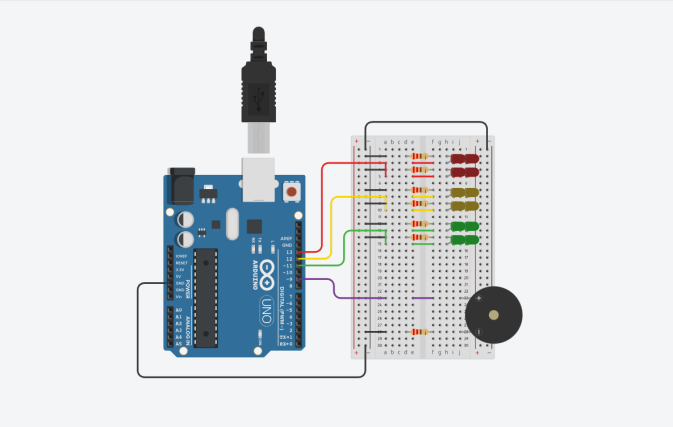

# ⭐ ⭐ ⭐ Proyecto grupal SPD ⭐ ⭐ ⭐

## Alumno
  * Alejandro Tomas Falanga

## Integrantes del grupo
 
 * Flores Brandon
 * Corimayo Alan
 * Falanga Alejandro
 * Fleitas Ezequiel
 * Yapura Franco

## Proyecto: Semáforo para no videntes	



### Descripción

el proyecto consiste en, mediante el uso de un arduino, 3 leds y un pienzo, simular un semaforo para gente no vidente, el cual dependiendo de que luz este activa, el pienzo actuara de una forma diferente. 

###  Función principal	

La función principal se encarga de vincular el encendido de la led de un color específico con el sonido del piezo a una frecuencia determinada para que cada color y sonido tenga su funcion en base al tiempo especificado


La funcion "Semaforo" iniciará con el for para encender el led rojo
e iniciar el piezo a la frecuencia indicada para luego esperar 1 segundo,
esto se repite 30 veces, logrando los 30 segundos
Luego pasa al amarillo, en el cual apaga al anterior y suena el piezo
a una fecuencia distinta, para luego esperar dos segundos, repitiendolo
3 veces, logrando los 5 segundos(aprox)
Luego pasa al verde, que apaga al anterior y solo se queda prendido
45 segundos (ya que no tiene piezo y por lo tanto no necesita un for),
Por último, se ejecuta una vez más el amarillo, exactamente igual que antes,
Una vez terminados todos el loop comienza de nuevo y se ejecuta 
a la perfección.

### codigo


```c++

void Semaforo()
{
  for(int i=0;i<30;i++)
  { 
    digitalWrite(led_rojo,1); 
    digitalWrite(led_amarillo,0); 
    digitalWrite(led_verde,0); 
    tone(Piezo,1000,500);
    delay(1000); 
  }
 for(int i=0;i<3;i++) 
  {
    digitalWrite(led_rojo,0); 
    digitalWrite(led_amarillo,1);
    tone(Piezo,100,50);
    delay(2000);
  }
  digitalWrite(led_amarillo,0); 
  digitalWrite(led_verde,1); 
  delay(45000); 
  for(int i=0;i<3;i++) 
  {
    digitalWrite(led_verde,0);
    digitalWrite(led_amarillo,1);
    tone(Piezo,100,50);
    delay(2000); 
  }
}

```

##  Link al proyecto en Tinkercard

[tinkercard.com](https://www.tinkercad.com/things/37ccMppQhB1-1j-spd-ejercicio-dojos/editel?sharecode=3MVdRKb0hAKTQ7lR3MnpTVfMYtzgUW0z4c4jHSscBUM "Link al arduino")

### Consigna
(https://classroom.google.com/c/NTUyNTQzNTI4MjMw/m/NjA1NDA2MDgzNzg4/details)


###  Fuentes

(https://www.youtube.com/watch?v=oxaH9CFpeEE)

(https://github.com/Estebamq/EjemploDocumentacion)

(https://www.youtube.com/watch?v=xBLYrbYIxLA)

